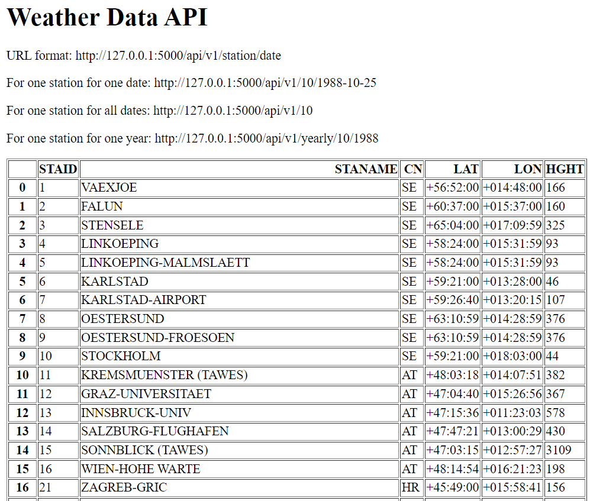
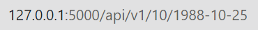
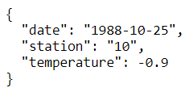
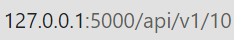
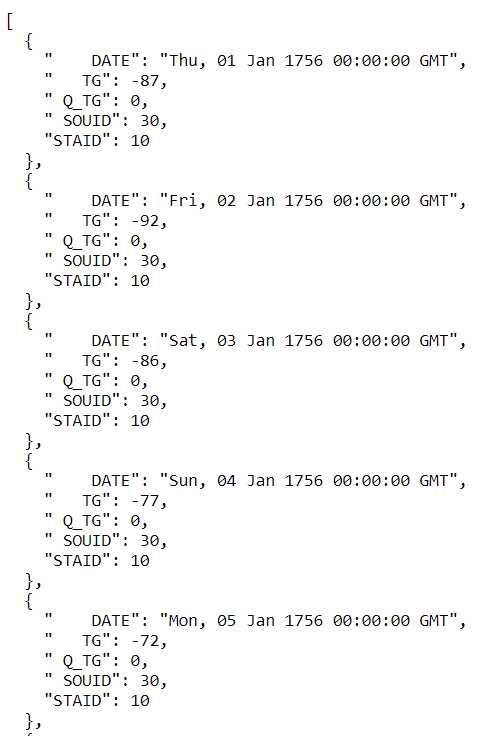
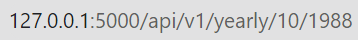
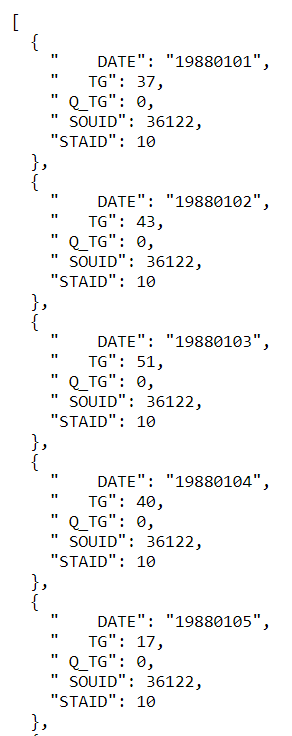

# Build Historical Weather Data API Using Python

## Project Description

**Overview :**  
The Historical Weather Data API project aims to provide users with access to historical temperature data based on specific dates and weather stations. The API allows users to retrieve temperature information for a given station and date, view all data for a particular station across all dates, and obtain all data for a specific station within a particular year.

**Challenges :**  
Build The Historical Weather Data using python and the Flask framework to create a RESTful API that interacts with historical weather datasets.

## Project Goal

The project aims to to provide users with access to historical temperature data based on specific dates and weather stations.

## Tools & Library Used

 &nbsp;

## Project Result

[Click here to get full code](https://github.com/nickenshidqia/Build_Historical_Weather_Data_API_Using_Python/blob/ca78abd6c1d939e0382be3d30e794bf5ad228864/main.py)  

### Homepage  
- The user could see URL format to use, also could get information what Station ID and Name included in this Weather Data API
  

### Retrieve Temperature by Date and Station

- Endpoint:  
  
- Description: Allows users to fetch temperature data for a specific weather station on a given date.  
  

### Retrieve All Data for One Station

- Endpoint:  
  
- Description: Provides users with all available temperature data for a particular weather station across all dates.  
  

### Retrieve All Data for One Station in a Year

- Endpoint:  
  
- Description: Enables users to access all temperature data for a specific weather station within a specified year  
  
